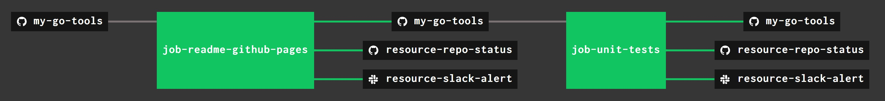

# my-go-tools

_A place to keep useful tools I created in go.

[GitHub Webpage](https://jeffdecola.github.io/my-go-tools/).

## USEFUL TOOLS I CREATED

* [decryptfile](https://github.com/JeffDeCola/my-go-tools/tree/master/decryptfile)

  _Decrypt a file with AES-256 GCM (a 32-byte hash key) using the `crypto/aes` package.
  Works with
  [encryptfile](https://github.com/JeffDeCola/my-go-tools/tree/master/encryptfile)._

* [encryptfile](https://github.com/JeffDeCola/my-go-tools/tree/master/encryptfile)

  _Encrypt a file with AES-256 GCM (a 32-byte hash key) using the `crypto/aes` package.
  Works with
  [decryptfile](https://github.com/JeffDeCola/my-go-tools/tree/master/decryptfile)._

* [markdown-create-table-of-contents](https://github.com/JeffDeCola/my-go-tools/tree/master/markdown-create-table-of-contents)

  _Parse a markdown file to find `##`, `###` to create a table of contents (TOC)
  for links at github.  I like to use a TOC at the beginning of my README.md files._

* [markdown-delimiter-doer](https://github.com/JeffDeCola/my-go-tools/tree/master/markdown-delimiter-doer)

  _Take a markdown file and "do whatever you want" between the delimiters
  and output new markdown file._

* [md5-hash-file](https://github.com/JeffDeCola/my-go-tools/tree/master/md5-hash-file)

  _Get an md5 hash (fingerprint) from an input file using the standard
  `crypto/md5` package.
  I also added a flag to read in your `.ssh/id_rsa.pub` key to get your ssh fingerprint._
  
## UPDATE GITHUB WEBPAGE USING CONCOURSE (OPTIONAL)

For fun, I use concourse to update
[my-go-tools GitHub Webpage](https://jeffdecola.github.io/my-go-tools/)
and alert me of the changes via repo status and slack.

A pipeline file [pipeline.yml](https://github.com/JeffDeCola/my-go-tools/tree/master/ci/pipeline.yml)
shows the entire ci flow. Visually, it looks like,

The `jobs` and `tasks` are,

* `job-readme-github-pages` runs task
  [readme-github-pages.sh](https://github.com/JeffDeCola/my-go-tools/tree/master/ci/scripts/readme-github-pages.sh).

The concourse `resources types` are,

* `my-go-tools` uses a resource type
  [docker-image](https://hub.docker.com/r/concourse/git-resource/)
  to PULL a repo from github.
* `resource-slack-alert` uses a resource type
  [docker image](https://hub.docker.com/r/cfcommunity/slack-notification-resource)
  that will notify slack on your progress.
* `resource-repo-status` uses a resource type
  [docker image](https://hub.docker.com/r/dpb587/github-status-resource)
  that will update your git status for that particular commit.

For more information on using concourse for continuous integration,
refer to my cheat sheet on [concourse](https://github.com/JeffDeCola/my-cheat-sheets/tree/master/software/operations-tools/continuous-integration-continuous-deployment/concourse-cheat-sheet).
