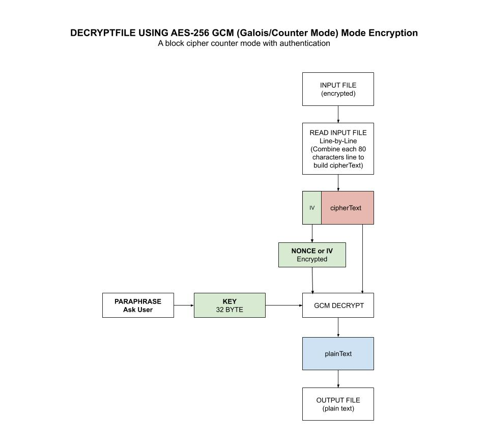

# decryptfile tool

_A useful tool for
decryptfile a file with AES-256 GCM (a 32-byte hash key) using the `crypto/aes` package.
Works with
[encryptfile](https://github.com/JeffDeCola/my-go-tools/tree/master/cryptography-tools/encryptfile)._

tl;dr,

```bash
# INSTALL VIA GO
go install decryptfile.go

# ENCRYPT FILE
encryptfile -i mysecrets.txt -o encrypted.txt

# DECRYPT FILE
decryptfile -i encrypted.txt -o mysecrets.txt
```

Table of Contents,

* [OVERVIEW](https://github.com/JeffDeCola/my-go-tools/tree/master/cryptography-tools/decryptfile#overview)
  * [STEP 1 - CREATE A HASH KEY](https://github.com/JeffDeCola/my-go-tools/tree/master/cryptography-tools/decryptfile#step-1---create-a-hash-key)
  * [STEP 2 - DECRYPT FILE WITH 32 BYTE HASH KEY](https://github.com/JeffDeCola/my-go-tools/tree/master/cryptography-tools/decryptfile#step-2---decrypt-file-with-32-byte-hash-key)
* [PREREQUISITES](https://github.com/JeffDeCola/my-go-tools/tree/master/cryptography-tools/decryptfile#prerequisites)
* [RUN](https://github.com/JeffDeCola/my-go-tools/tree/master/cryptography-tools/decryptfile#run)
* [TEST](https://github.com/JeffDeCola/my-go-tools/tree/master/cryptography-tools/decryptfile#test)
* [INSTALL](https://github.com/JeffDeCola/my-go-tools/tree/master/cryptography-tools/decryptfile#install)
* [USAGE](https://github.com/JeffDeCola/my-go-tools/tree/master/cryptography-tools/decryptfile#usage)
  * [-h](https://github.com/JeffDeCola/my-go-tools/tree/master/cryptography-tools/decryptfile#-h)
  * [-v](https://github.com/JeffDeCola/my-go-tools/tree/master/cryptography-tools/decryptfile#-v)
  * [-i string, -o string](https://github.com/JeffDeCola/my-go-tools/tree/master/cryptography-tools/decryptfile#-i-string--o-string)
  * [-paraphrasefile string](https://github.com/JeffDeCola/my-go-tools/tree/master/cryptography-tools/decryptfile#-paraphrasefile-string)
  * [-loglevel string](https://github.com/JeffDeCola/my-go-tools/tree/master/cryptography-tools/decryptfile#-loglevel-string)

Documentation and references,

* Use my other tool
  [encryptfile](https://github.com/JeffDeCola/my-go-tools/tree/master/cryptography-tools/encryptfile)
  to encrypt
* Refer to my
  [aes-256-gcm](https://github.com/JeffDeCola/my-go-examples/tree/master/cryptography/symmetric-cryptography/aes-256-gcm)
  example in `my-go-examples` repo on how I did the decryption.
* This repos
  [github webpage](https://jeffdecola.github.io/my-go-tools/)
  _built with
  [concourse](https://github.com/JeffDeCola/my-go-tools/blob/master/ci-README.md)_

## OVERVIEW

The Advanced Encryption Standard, or AES, is a symmetric
block cipher chosen by the U.S. government to protect classified
information and is implemented in software and hardware throughout
the world to encrypt sensitive data.

We're going to use AES-256 GCM encryption from the standard go
[crypto/aes](https://golang.org/pkg/crypto/aes/)
package.

### STEP 1 - CREATE A HASH KEY

First you need a 32 byte key (AES-256). Instead of typing a 32
character in, lets make it simple by turning a simple paraphrase into a key.
We will use the standard go
[crypto/md5](https://golang.org/pkg/crypto/md5/)
package.

```go
hasher := md5.New()
hasher.Write([]byte(paraphrase))
hash := hex.EncodeToString(hasher.Sum(nil))
```

### STEP 2 - DECRYPT FILE WITH 32 BYTE HASH KEY

The encryption was done using AES-256 GCM from my example
[aes-256-gcm](https://github.com/JeffDeCola/my-go-examples/tree/master/cryptography/symmetric-cryptography/aes-256-gcm)
Refer to that example for a complete description.

This illustration may help,



## PREREQUISITES

I used the following language,

* [go](https://github.com/JeffDeCola/my-cheat-sheets/tree/master/software/development/languages/go-cheat-sheet)

You will need the following go packages,

```bash
go get -u -v github.com/sirupsen/logrus
```

## RUN

The following steps are located in
[run.sh](https://github.com/JeffDeCola/my-go-tools/blob/master/cryptography-tools/decryptfile/run.sh).

To run
[decryptfile.go](https://github.com/JeffDeCola/my-go-tools/blob/master/cryptography-tools/decryptfile/decryptfile.go)
from the command line,

```bash
go run . -i encrypted.txt -o mysecrets.txt
go run decryptfile.go -i encrypted.txt -o mysecrets.txt
go run decryptfile.go -i encrypted.txt -o mysecrets.txt -loglevel trace
go run decryptfile.go -i encrypted.txt -o mysecrets.txt -paraphrasefile paraphrase.txt
go run decryptfile.go -i encrypted.txt -o mysecrets.txt -paraphrasefile ~/.ssh/id_rsa
```

Use the paraphrase `test`.

## TEST

The following steps are located in
[unit-tests.sh](https://github.com/JeffDeCola/my-go-tools/blob/master/cryptography-tools/decryptfile/test/unit-tests.sh).

To create `_test` files,

```bash
gotests -w -all decryptfile.go
```

To unit test the code,

```bash
go test -cover ./... | tee test/test_coverage.txt
cat test/test_coverage.txt
```

## INSTALL

Will place an executable in your go bin,

```bash
go install decryptfile.go
```

## USAGE

```txt
decryptfile {-h|-v} -i [input file] -o [output file] -paraphrasefile [file]
            -loglevel [level]
```

### -h

Help,

```bash
decryptfile -h
```

### -v

Version,

```bash
decryptfile -v
```

### -i string, -o string

Use a specific input file and output file`,

```bash
decryptfile -i encrypted.txt -o mysecrets.txt
```

### -paraphrasefile string

Use a file as the paraphrase,

```bash
decryptfile -i encrypted.txt -o mysecrets.txt -paraphrasefile ~/.ssh/id_rsa
```

### -loglevel string

Can use trace, info or error,

```bash
decryptfile -i encrypted.txt -o mysecrets.txt -loglevel trace
```
