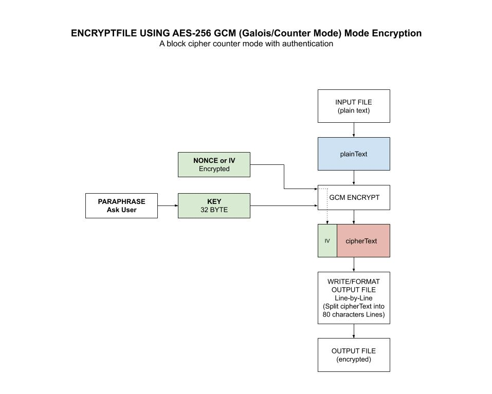

# encryptfile TOOL

_Encrypt a file with AES-256 GCM (a 32-byte hash key) using the `crypto/aes` package.
Works with
[decryptfile](https://github.com/JeffDeCola/my-go-tools/tree/master/cryptography-tools/decryptfile)._

tl;dr,

```bash
# INSTALL VIA GO
go install encryptfile.go

# ENCRYPT FILE
encryptfile -i mysecrets.txt -o encrypted.txt

# DECRYPT FILE
decryptfile -i encrypted.txt -o mysecrets.txt
```

Table of Contents

* [OVERVIEW](https://github.com/JeffDeCola/my-go-tools/tree/master/cryptography-tools/encryptfile#overview)
  * [STEP 1 - CREATE A HASH KEY](https://github.com/JeffDeCola/my-go-tools/tree/master/cryptography-tools/encryptfile#step-1---create-a-hash-key)
  * [STEP 2 - ENCRYPT FILE WITH 32 BYTE HASH KEY](https://github.com/JeffDeCola/my-go-tools/tree/master/cryptography-tools/encryptfile#step-2---encrypt-file-with-32-byte-hash-key)
* [PREREQUISITES](https://github.com/JeffDeCola/my-go-tools/tree/master/cryptography-tools/encryptfile#prerequisites)
* [RUN](https://github.com/JeffDeCola/my-go-tools/tree/master/cryptography-tools/encryptfile#run)
* [TEST](https://github.com/JeffDeCola/my-go-tools/tree/master/cryptography-tools/encryptfile#test)
* [INSTALL](https://github.com/JeffDeCola/my-go-tools/tree/master/cryptography-tools/encryptfile#install)
* [USAGE](https://github.com/JeffDeCola/my-go-tools/tree/master/cryptography-tools/encryptfile#usage)
  * [-h](https://github.com/JeffDeCola/my-go-tools/tree/master/cryptography-tools/encryptfile#-h)
  * [-v](https://github.com/JeffDeCola/my-go-tools/tree/master/cryptography-tools/encryptfile#-v)
  * [-i string, -o string](https://github.com/JeffDeCola/my-go-tools/tree/master/cryptography-tools/encryptfile#-i-string--o-string)
  * [-paraphrasefile string](https://github.com/JeffDeCola/my-go-tools/tree/master/cryptography-tools/encryptfile#-paraphrasefile-string)
  * [-loglevel string](https://github.com/JeffDeCola/my-go-tools/tree/master/cryptography-tools/encryptfile#-loglevel-string)

Documentation and Reference

* Use my other tool
  [decryptfile](https://github.com/JeffDeCola/my-go-tools/tree/master/cryptography-tools/decryptfile)
  to decrypt
* Refer to my
  [aes-256-gcm](https://github.com/JeffDeCola/my-go-examples/tree/master/cryptography/symmetric-cryptography/aes-256-gcm)
  example in
  [my-go-examples](https://github.com/JeffDeCola/my-go-examples)
  repo on how I did the encryption
* This repos
  [github webpage](https://jeffdecola.github.io/my-go-tools/)
  _built with
  [concourse](https://github.com/JeffDeCola/my-go-tools/blob/master/ci-README.md)_

## OVERVIEW

The Advanced Encryption Standard, or AES, is a symmetric
block cipher chosen by the U.S. government to protect classified
information and is implemented in software and hardware throughout
the world to encrypt sensitive data.

We're going to use AES-256 GCM encryption from the standard go
[crypto/aes](https://golang.org/pkg/crypto/aes/)
package.

### STEP 1 - CREATE A HASH KEY

First you need a 32 byte key (AES-256). Instead of typing a 32
character in, lets make it simple by turning a simple paraphrase into a key.
We will use the standard go
[crypto/md5](https://golang.org/pkg/crypto/md5/)
package.

```go
hasher := md5.New()
hasher.Write([]byte(paraphrase))
hash := hex.EncodeToString(hasher.Sum(nil))
```

### STEP 2 - ENCRYPT FILE WITH 32 BYTE HASH KEY

The encryption was done using AES-256 GCM from my example
[aes-256-gcm](https://github.com/JeffDeCola/my-go-examples/tree/master/cryptography/symmetric-cryptography/aes-256-gcm).

Refer to that example for a complete description.

This illustration may help,



## PREREQUISITES

You will need the following go packages,

```bash
go install -v github.com/sirupsen/logrus
```

## RUN

To
[run.sh](https://github.com/JeffDeCola/my-go-tools/blob/master/cryptography-tools/encryptfile/run.sh),

```bash
go run encryptfile.go -i mysecrets.txt -o encrypted.txt
go run encryptfile.go -i mysecrets.txt -o encrypted.txt
go run encryptfile.go -i mysecrets.txt -o encrypted.txt -loglevel trace
go run encryptfile.go -i mysecrets.txt -o encrypted.txt -paraphrasefile paraphrase.txt
go run encryptfile.go -i mysecrets.txt -o encrypted.txt -paraphrasefile ~/.ssh/id_rsa
```

Use the paraphrase `test`.

## TEST

To create _test files,

```bash
gotests -w -all encryptfile.go
```

To
[unit-tests.sh](https://github.com/JeffDeCola/my-go-tools/blob/master/cryptography-tools/encryptfile/test/unit-tests.sh),

```bash
go test -cover ./... | tee test/test_coverage.txt
cat test/test_coverage.txt
```

## INSTALL

Will place an executable in your go bin,

```bash
go install encryptfile.go
```

## USAGE

```txt
encryptfile {-h|-v} -i [input file] -o [output file] -paraphrasefile [file]
            -loglevel [level]
```

### -h

Help,

```bash
encryptfile -h
```

### -v

Version,

```bash
encryptfile -v
```

### -i string, -o string

Use a specific input file and output file,

```bash
encryptfile -i mysecrets.txt -o encrypted.txt
```

### -paraphrasefile string

Use a file as the paraphrase,

```bash
encryptfile -i mysecrets.txt -o encrypted.txt -paraphrasefile ~/.ssh/id_rsa
```

### -loglevel string

Can use trace, info or error,

```bash
encryptfile -i mysecrets.txt -o encrypted.txt -loglevel trace
```
