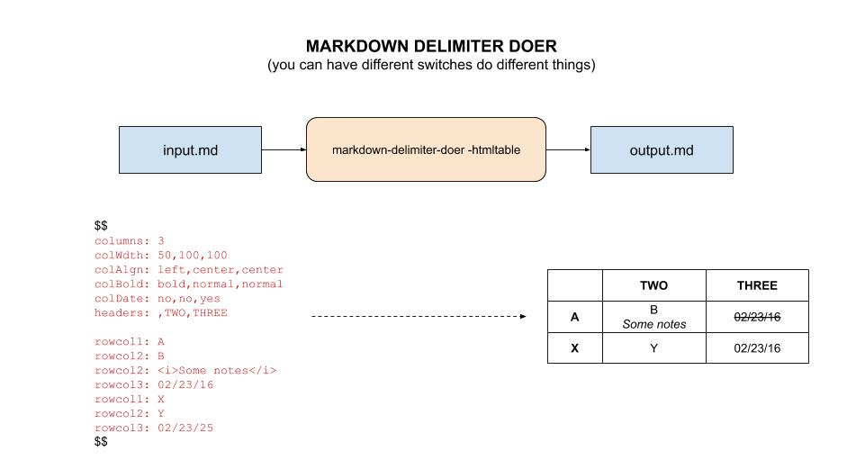

# markdown-delimiter-doer tool

`markdown-delimiter-doer` _is a useful tool for
taking a markdown file and "do whatever you want" between the delimiters
and output new markdown file._

Table of Contents,

* [OVERVIEW](https://github.com/JeffDeCola/my-go-tools/tree/master/markdown-tools/markdown-delimiter-doer#overview)
* [PREREQUISITES](https://github.com/JeffDeCola/my-go-tools/tree/master/markdown-tools/markdown-delimiter-doer#prerequisites)
* [RUN](https://github.com/JeffDeCola/my-go-tools/tree/master/markdown-tools/markdown-delimiter-doer#run)
* [TEST](https://github.com/JeffDeCola/my-go-tools/tree/master/markdown-tools/markdown-delimiter-doer#test)
* [INSTALL](https://github.com/JeffDeCola/my-go-tools/tree/master/markdown-tools/markdown-delimiter-doer#install)
* [USAGE](https://github.com/JeffDeCola/my-go-tools/tree/master/markdown-tools/markdown-delimiter-doer#usage)
  * [-h](https://github.com/JeffDeCola/my-go-tools/tree/master/markdown-tools/markdown-delimiter-doer#-h)
  * [-v](https://github.com/JeffDeCola/my-go-tools/tree/master/markdown-tools/markdown-delimiter-doer#-v)
  * [-delimiter string](https://github.com/JeffDeCola/my-go-tools/tree/master/markdown-tools/markdown-delimiter-doer#-delimiter-string)
  * [-i string, -o string](https://github.com/JeffDeCola/my-go-tools/tree/master/markdown-tools/markdown-delimiter-doer#-i-string--o-string)
  * [-htmltable](https://github.com/JeffDeCola/my-go-tools/tree/master/markdown-tools/markdown-delimiter-doer#-htmltable)
  * [-debug](https://github.com/JeffDeCola/my-go-tools/tree/master/markdown-tools/markdown-delimiter-doer#-debug)
* [FUTURE](https://github.com/JeffDeCola/my-go-tools/tree/master/markdown-tools/markdown-delimiter-doer#future)

Documentation and references,

* This repos
  [github webpage](https://jeffdecola.github.io/my-go-tools/)
  _built with
  [concourse](https://github.com/JeffDeCola/my-go-tools/blob/master/ci-README.md)_

## OVERVIEW

This tool is useful for "doing something" in a file between a delimiter.

## PREREQUISITES

I used the following language,

* [go](https://github.com/JeffDeCola/my-cheat-sheets/tree/master/software/development/languages/go-cheat-sheet)

You will need the following go packages,

```bash
go get -u -v github.com/sirupsen/logrus
```

## RUN

The following steps are located in
[run.sh](https://github.com/JeffDeCola/my-go-tools/blob/master/markdown-tools/markdown-delimiter-doer/run.sh).

To run
[markdown-delimiter-doer.go](https://github.com/JeffDeCola/my-go-tools/blob/master/markdown-tools/markdown-delimiter-doer/markdown-delimiter-doer.go)
from the command line,

Run using delimiters `$$` and the `-htmltable` switch on input.md,

```bash
go run . -delimiter \$\$ -i input.md -o output.md -htmltable
go run markdown-delimiter-doer.go htmlswitch.go -delimiter \$\$ -i input.md -o output.md -htmltable
go run markdown-delimiter-doer.go htmlswitch.go -delimiter \$\$ -i input.md -o output.md -htmltable -debug
```

## TEST

The following steps are located in
[unit-tests.sh](https://github.com/JeffDeCola/my-go-tools/blob/master/markdown-tools/markdown-delimiter-doer/test/unit-tests.sh).

To create `_test` files,

```bash
gotests -w -all markdown-delimiter-doer.go
```

To unit test the code,

```bash
go test -cover ./... | tee test/test_coverage.txt
cat test/test_coverage.txt
```

## INSTALL

Will place an executable in your go bin,

```bash
go install markdown-delimiter-doer.go htmlswitch.go 
```

## USAGE

```txt
markdown-delimiter-doer {-h|-v|-debug} -delimiter [delimiter] -i [input file] -o [output file] -htmltable
```

### -h

Help,

```bash
markdown-delimiter-doer -h
```

### -v

Version,

```bash
markdown-delimiter-doer -v
```

### -delimiter string

The delimiter you want to use.

### -i string, -o string

The `-i` and `-o` switches are used to define the input and output file respectively.

```bash
markdown-delimiter-doer -i input.md -o output.md
```

Running this command won't do anything, you need to use a switch like -htmltable.

### -htmltable

This switch is used to create an html table,

```bash
markdown-delimiter-doer -delimiter \$\$ -i input.md -o output.md -htmltable
```

Here is an illustration using the `-htmltable` switch,



It will even check the dates and strikethrough them automatically.

### -debug

```bash
markdown-delimiter-doer -delimiter \$\$ -i input.md -o output.md -htmltable -debug
```

## FUTURE

The ability to add more switches to do whatever you want between delimiters.
